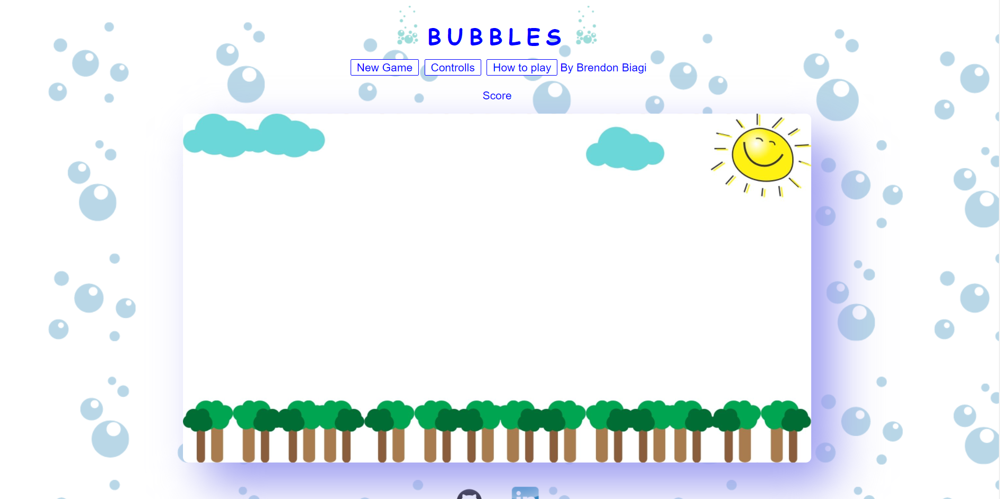

<link rel="stylesheet" href="./style.css">
<link rel="icon" type="image/png" href="./images/icon.png"/>

# About Me:

**Full Stack Developer, based in Queens, with proven success at learning things quickly**

<a target="_blank" href="https://drive.google.com/file/d/1AsTQNu3M0gmi4ZkAlve4Ibas4-M9C8jm/view?usp=sharing">
View My Resume
</a>

## Languages Known:

<!-- Java Script -->

<!-- React -->

<!-- Redux -->

<!-- HTML -->

<!-- CSS -->

<!-- Ruby -->

<!-- Rails -->

<!-- SQL -->

<!-- Postgres SQL -->

<!-- SQL Lite -->

<!-- Git -->

# Projects I've Created:

<h3>Bubbles</h3>

Bubbles is a 2D game where you control a bubble, built with JavaScript, HTML and Canvas

<h3>Take A Hike</h3>

Take A Hike is an app for finding trails to hike on developed with the MERN stack

<h3>QuestRabbit</h3>

QuestRabbit is a Full Stack clone of Task Rabbit using React, Redux, Rails, & Postgres

# Find me:
[github](https://github.com/Bman2386)
[linkedin](https://www.linkedin.com/in/brendonbiagi/)
