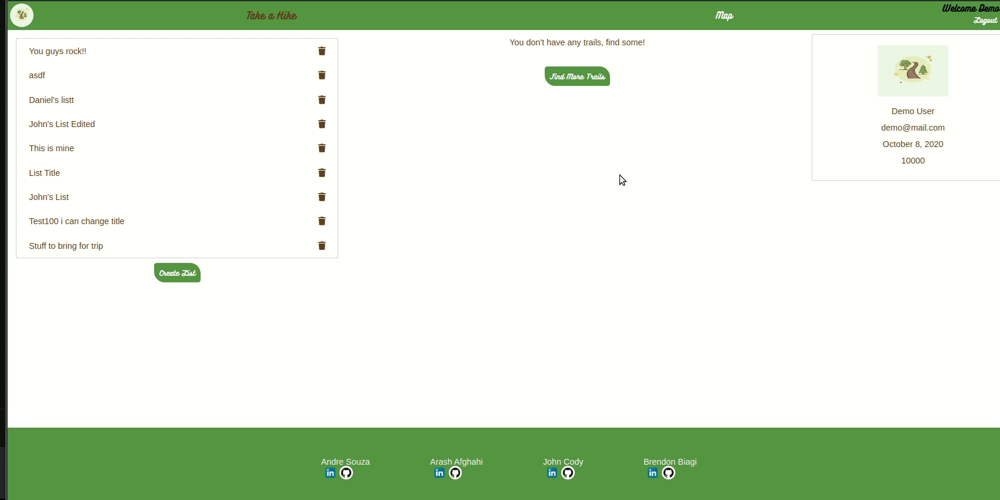

<head>
<link rel="stylesheet" href="./style.css">
<link rel='icon' type='image/png' href='./images/computer.png'/>
<!--  -->
</head>

# About Me:

<h2>Full Stack Developer, based in Queens, with proven success at learning things quickly</h2>

Hi there! I am a Full Stack Developer. It has always been my dream to code and <a target="_blank" href="https://www.appacademy.io/">AppAcademy</a> has facilitated that for me. Currently I'm based in Astoria Queens, having a blast coding away. You should take some time and review my recent projects.

<a target="_blank" class='a2' href="https://drive.google.com/file/d/1AsTQNu3M0gmi4ZkAlve4Ibas4-M9C8jm/view?usp=sharing">
View My Resume
</a>

## Languages Known:

Java Script

React

Redux

HTML

CSS

Ruby

Rails

SQL

Postgres SQL

SQL Lite

Git

# Projects I've Created:

<h3>BUBBLES</h3>

Bubbles is a 2D game where you control a bubble, built with JavaScript, HTML and Canvas

<h3>Take A Hike</h3>

Take A Hike is an app for finding trails to hike on developed with the MERN stack

<h3>QuestRabbit</h3>

QuestRabbit is a Full Stack clone of Task Rabbit using React, Redux, Rails, & Postgres

# Find me:

<a target="_blank" class='a2' href="https://github.com/Bman2386">github</a>
<a target="_blank" class='a2' href="https://www.linkedin.com/in/brendonbiagi/">linkedin</a>
<a target="_blank" class='a2' href="https://drive.google.com/file/d/1AsTQNu3M0gmi4ZkAlve4Ibas4-M9C8jm/view?usp=sharing">
View My Resume
</a>

